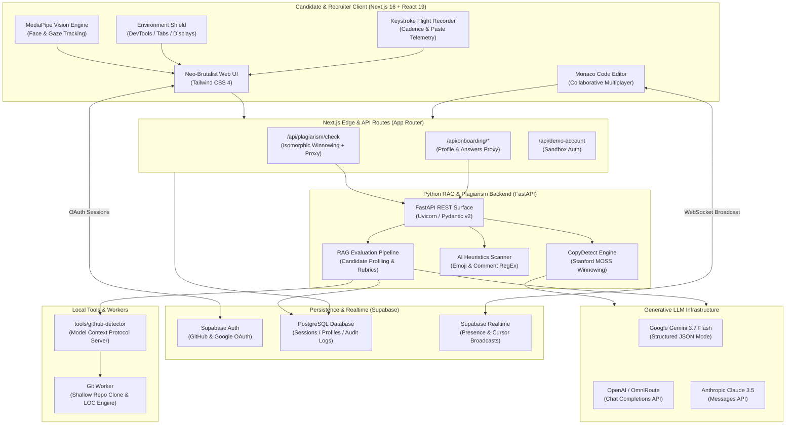
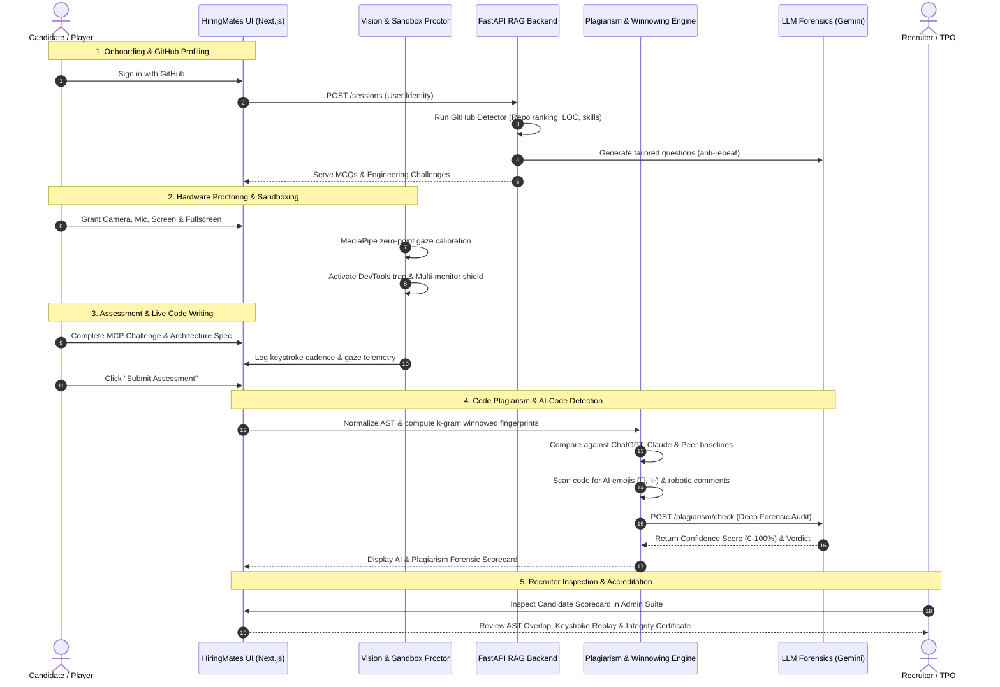

# HiringMates ⚡

> **Next-Gen AI Technical Hiring, Real-Time Multiplayer Coding Competitions & High-Signal Anti-Cheating Assessment Platform.**

[](https://nextjs.org/)
[](https://react.dev/)
[](https://tailwindcss.com/)
[](https://python.org/)
[](https://fastapi.tiangolo.com/)
[](https://supabase.com/)
[](https://ai.google.dev/)
[](LICENSE)

---

## 📌 Table of Contents

- [The Problem We Are Addressing](#-the-problem-we-are-addressing)
- [The Solution We Provide](#-the-solution-we-provide)
- [High-Level Architecture](#-high-level-architecture)
- [Complete Tech Stack](#-complete-tech-stack)
- [End-to-End Workflow](#-end-to-end-workflow)
- [Key Features](#-key-features)
- [Repository Structure](#-repository-structure)
- [Getting Started](#-getting-started)
  - [Prerequisites](#prerequisites)
  - [Frontend Setup (Next.js)](#frontend-setup-nextjs)
  - [Backend Setup (FastAPI RAG)](#backend-setup-fastapi-rag)
  - [GitHub Detector MCP Server](#github-detector-mcp-server)
- [Testing & Quality Assurance](#-testing--quality-assurance)

---

## 🛑 The Problem We Are Addressing

Modern technical recruitment is facing an existential integrity crisis:

1. **The GenAI Cheating Epidemic**: With ChatGPT, Claude, and Copilot readily accessible, candidates can generate textbook code solutions in seconds. Over 70% of take-home assignments and unproctored coding assessments contain unverified AI-generated code.
2. **Decorative AI Hallmarks & Copy-Paste Injections**: LLMs systematically insert formulaic step-by-step comments, markdown residue, and decorative emojis (e.g., `// 🚀 Step 1: Initialize...`, `console.log('✅ Done')`) that human developers never write organically.
3. **Resume & GitHub Exaggeration**: Resumes boast extensive expertise, but traditional screenings fail to verify real commit history, structural code quality, architecture patterns, or test coverage.
4. **Impractical Trivia Assessments**: Traditional platforms evaluate candidates on inverted binary trees and memorized LeetCode puzzles rather than authentic systems architecture (MCP protocols, distributed task workers, API resilience).
5. **Collusion, Dual-Display & Screen Sharing Fraud**: Candidates split screens, connect secondary displays, switch browser tabs, or use external smartphones during virtual interviews.
6. **Recruiter Burnout**: Engineering teams waste hundreds of hours conducting redundant introductory rounds on candidates whose code was ghost-written by AI..

---

## 💡 The Solution We Provide

**HiringMates** is an end-to-end, high-signal engineering evaluation ecosystem designed for genuine skill discovery and uncompromising test integrity:

* 🛡️ **Dual-Layer Code Plagiarism & AI-Code Detection**:
  - Implements the open-source **`copydetect`** token-winnowing algorithm (Stanford MOSS standard) to generate structural AST fingerprints invariant to variable renaming, whitespace, and formatting.
  - Heuristic detection of **AI markers**, extracting generative emojis (`🚀`, `✨`, `💡`, `🤖`, `✅`, `⚡`) and robotic step commentary.
  - Backend **LLM Deep Forensics** (Gemini 3.7 Flash, OpenAI, Anthropic) producing a calibrated **Confidence Score (0–100%)** and audit reports.
* 👁️ **Client-Side AI Vision Proctoring**:
  - In-browser face and eye-gaze tracking via Google MediaPipe (`@mediapipe/tasks-vision`) detecting gaze deviation, multiple faces, and unauthorized foreign objects (smartphones).
* 🔒 **Hardened Browser Environment Shield**:
  - Fullscreen enforcement, DevTools shortcut trapping, context menu prevention, Screen Details API secondary-display detection, and instant tab-switching penalties.
* ⌨️ **Keystroke Dynamics Flight Recorder**:
  - Records real-time typing cadence, WPM bursts, backspace frequency, and paste actions to differentiate organic human rhythm from burst paste injections.
* 🕹️ **CodeMates Arcade**:
  - Real-time multiplayer coding competitions featuring dynamic Monaco Editor synchronization, live cursor broadcasting, presence tracking, and instant automated integrity audits.
* 🔍 **Automated GitHub Profiling & Tailored RAG Backend**:
  - Standalone MCP server that deep-indexes candidate GitHub repositories, computes structural fingerprints (CI, Docker, tests, LOC), and generates unique, non-repeating assessment questions tailored to the candidate's exact background.
lmao
---

## 🏛️ High-Level Architecture



---

## 🧰 Complete Tech Stack

### Frontend & Client Applications
| Category | Technology | Version | Purpose |
|---|---|---|---|
| **Framework** | [Next.js (Turbopack)](https://nextjs.org/) | `16.3.3` | App Router, Server Components, Route Handlers |
| **Core Library** | [React](https://react.dev/) | `19.0.0` | UI component tree with concurrent rendering |
| **Styling** | [Tailwind CSS](https://tailwindcss.com/) | `4.3.3` | Neo-Brutalism design system with `@tailwindcss/postcss` |
| **Icons** | [Lucide React](https://lucide.dev/) | `^1.16.0` | Crisp UI iconography |
| **Code Editor** | [Monaco Editor](https://microsoft.github.io/monaco-editor/) | `@monaco-editor/react ^4.7.0` | In-browser VS Code experience with multi-cursor sync |
| **Vision AI** | [MediaPipe Tasks Vision](https://developers.google.com/mediapipe) | `@mediapipe/tasks-vision ^1.0.1` | Real-time face mesh, iris tracking & foreign object detection |

### Realtime & Persistence
| Service | Library | Purpose |
|---|---|---|
| **Database** | [Supabase PostgreSQL](https://supabase.com/) | User profiles, assessment answers, audit logs with Row-Level Security (RLS) |
| **Realtime WebSockets** | `@supabase/supabase-js ^2.116.0` | Multiplayer room lobbies, live code cursors, and presence tracking |
| **Authentication** | Supabase SSR (`@supabase/ssr ^0.12.7`) | GitHub OAuth, Google linking, and JWT verification |

### Backend & AI Systems
| Component | Stack | Purpose |
|---|---|---|
| **Web Service** | Python 3.11+, [FastAPI](https://fastapi.tiangolo.com/), [Uvicorn](https://www.uvicorn.org/) | Asynchronous RAG assessment and plagiarism REST API |
| **Validation** | [Pydantic v2](https://docs.pydantic.dev/) | Strict domain models (`Identity`, `PlagiarismAnalysis`, `Grade`) |
| **Primary LLM** | [Google GenAI SDK](https://github.com/google/generative-ai-python) (`google-genai`) | Gemini 3.7 Flash default grading and forensic reasoning |
| **Alternative LLMs** | [OpenAI API](https://platform.openai.com/), [Anthropic API](https://www.anthropic.com/) | Compatible with OpenAI, OmniRoute, Groq, Together, and Claude |
| **Plagiarism Tool** | [copydetect](https://github.com/blingenf/copydetect) algorithms | Token normalization, polynomial rolling hash, windowed winnowing |
| **Tool Protocol** | [Model Context Protocol (MCP)](https://modelcontextprotocol.io/) | GitHub profile detector running over stdio |

---

## 🔄 End-to-End Workflow



---

## 🚀 Key Features

### 1. High-Signal Assessments (`HireMe.app`)
- **Realistic System Challenges**: Real architectural problems (e.g. Model Context Protocol incident response specification) instead of trivia.
- **Timed Submissions**: Individual question countdown timers with server-side elapsed time tracking.

### 2. Open-Source Plagiarism & AI-Code Detection
- **Token Winnowing Algorithm**: Strips comments, string literals, and variable identifiers; converts code to canonical AST tokens ($V_1, V_2, \text{LOP}, \text{CND}$) and calculates Jaccard similarity.
- **Emoji Scanner**: Detects and highlights generative AI decorative emojis (`🚀`, `✨`, `💡`, `🤖`, `✅`, `🔥`, `⚡`, `📌`).
- **Robotic Comment Analyzer**: Flags textbook step annotations (`// Step 1: Initialize...`, `// Helper function to...`, `// Time complexity: O(N)`).
- **Backend LLM Forensic Confidence**: Delivers an auditable score (0–100%) explaining why code was judged human-original or AI-generated.

### 3. CodeMates Arcade (Multiplayer Coding Arena)
- **Real-Time Multiplayer Monaco**: Synchronized code editing with colored peer cursors and presence badges.
- **Instant Test Runner**: Runs unit tests against candidate worker code with instant XP calculation.
- **Live Integrity Card**: Shows instant plagiarism, token match, and AI emoji feedback upon test execution.

### 4. Recruiter Admin & Campus TPO Suite
- **Interactive Keystroke Replay**: Step through the candidate's typing timeline with human cadence confidence scoring.
- **AST Branch Comparison**: Side-by-side token similarity meters against ChatGPT-4o, Claude 3.5 Sonnet, and peer clusters.
- **Cryptographic Session Certificates**: Tamper-evident integrity summaries ready for campus hiring audits.

---

## 📁 Repository Structure

```
hiringmates/
├── app/                              # Next.js 16 App Router
│   ├── api/                          # Server route handlers
│   │   ├── onboarding/               # Candidate session & answer endpoints
│   │   ├── plagiarism/check/         # Isomorphic plagiarism & AI-detection API
│   │   └── demo-account/             # Sandbox demo authentication
│   ├── codemates/                    # CodeMates multiplayer arena page
│   ├── hireme/                       # HireMe assessment & proctoring page
│   ├── layout.tsx                    # Root layout & providers
│   └── page.tsx                      # Main application shell
├── components/                       # UI Components (Neo-Brutalist design system)
│   ├── views/
│   │   ├── HireMeContent.tsx         # Assessment, proctoring & recruiter admin
│   │   ├── CodeMatesContent.tsx      # Multiplayer Monaco room & results view
│   │   ├── AuthorizedHome.tsx        # Dashboard view
│   │   └── AuthContent.tsx           # Authentication modal
│   └── AppShell.tsx                  # Persistent navigation header
├── lib/                              # Shared frontend utilities
│   ├── backend.ts                    # Python RAG backend HTTP client bridge
│   ├── supabase.ts                   # Supabase browser client
│   ├── supabase-server.ts            # Supabase server client with cookies
│   └── proctoring/
│       ├── antiCheatEngine.ts        # Winnowing, flight recorder & sandbox shields
│       └── eyeTracker.ts             # MediaPipe face & gaze tracker engine
├── backend/                          # Python FastAPI RAG & Plagiarism service
│   ├── api.py                        # FastAPI surface (/sessions, /plagiarism/check)
│   ├── pyproject.toml                # Python package metadata & dependencies
│   ├── rag/
│   │   ├── plagiarism.py             # Open-source CopyDetectEngine & AI scanner
│   │   ├── models.py                 # Pydantic v2 domain schemas
│   │   ├── pipeline.py               # Session stage machine & grading flow
│   │   ├── llm.py                    # Gemini, OpenAI & Anthropic LLM clients
│   │   ├── store.py                  # In-memory and Supabase persistence
│   │   └── scenarios.py              # Rubrics & system prompts
│   └── tests/                        # Pytest suite (plagiarism, pipeline, LLM)
└── tools/
    └── github-detector/              # MCP Server for GitHub profiling
        ├── app/mcp_server.py         # MCP stdio server implementation
        └── scripts/detect_cli.py     # Standalone CLI profile detector
```

---

## 🏁 Getting Started

### Prerequisites
- **Node.js**: `v20.x` or higher
- **Package Manager**: `npm`, `pnpm`, or `yarn`
- **Python**: `3.11` or higher
- **Supabase Account**: (Optional for local memory store, required for persistent auth)
- **Google GenAI API Key**: (For Gemini 3.7 Flash evaluations)

---

### Frontend Setup (Next.js)

1. **Install dependencies**:
   ```bash
   npm install
   ```

2. **Configure environment variables**:
   Create a `.env` file in the root directory:
   ```env
   NEXT_PUBLIC_SUPABASE_URL=https://your-project.supabase.co
   NEXT_PUBLIC_SUPABASE_ANON_KEY=your-anon-key
   BACKEND_BASE_URL=http://127.0.0.1:8000
   ```

3. **Run the Next.js development server**:
   ```bash
   npm run dev
   ```
   Open [http://localhost:3000](http://localhost:3000) in your browser.

---

### Backend Setup (FastAPI RAG)

1. **Navigate to the backend directory**:
   ```bash
   cd backend
   ```

2. **Create and activate a virtual environment**:
   ```bash
   python -m venv .venv
   # Windows
   .venv\Scripts\activate
   # macOS / Linux
   source .venv/bin/activate
   ```

3. **Install dependencies**:
   ```bash
   pip install -e ".[api,dev]"
   ```

4. **Configure backend environment**:
   Create `backend/.env`:
   ```env
   LLM_PROVIDER=gemini
   GEMINI_API_KEY=your_gemini_api_key
   GEMINI_MODEL=gemini-3.7-flash

   # Supabase service role key (optional, uses in-memory store if unset)
   SUPABASE_URL=https://your-project.supabase.co
   SUPABASE_SERVICE_ROLE_KEY=your_service_role_key
   ```

5. **Start the FastAPI server**:
   ```bash
   uvicorn api:app --reload --port 8000
   ```

---

### GitHub Detector MCP Server

1. **Install dependencies**:
   ```bash
   cd tools/github-detector
   pip install -r requirements.txt
   ```

2. **Add to your MCP Client Configuration** (e.g., Cursor, Claude Desktop, Antigravity):
   ```json
   {
     "mcpServers": {
       "github-detector": {
         "command": "python",
         "args": ["-m", "app.mcp_server"],
         "cwd": "/path/to/hiringmates/tools/github-detector"
       }
     }
   }
   ```

---

## 🧪 Testing & Quality Assurance

### Run Python Backend & Plagiarism Unit Tests
```bash
cd backend
python -m pytest
```
*Executes all 49 unit tests covering `CopyDetectEngine`, token winnowing, emoji heuristics, LLM JSON validation, and RAG pipelines.*

### Run Frontend Type Check & Production Build
```bash
# Type check TypeScript codebase
npx tsc --noEmit

# Compile production bundle with Next.js Turbopack
npx next build
```

---

## 📄 License

This project is licensed under the [MIT License](LICENSE).
